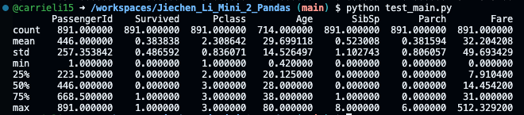
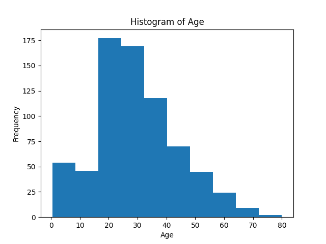

## Jiechen_Li_Mini_2_Pandas

The purpose of this repo is to generate the descriptive statistics on datasets using Pandas. 

### Files 

- ``.devcontainer`` configures local development container environment
- ``github/workflows/ci.yml`` triggers CI/CD on git push and pull request
- ``.gitignore`` specifies which files or directories should be excluded from version control when using Git
- ``Makefile`` build commands and utilities
- ``README.md`` instruction file for the readers
- ``requirements.txt`` specifies the dependencies (libraries and packages) required to run the project

### CI/CD

On git push/pull request the CI/CD flow is triggered using Github Actions:

1. Install and validate Rust toolchain
2. Format and lint code
3. Run unit tests
4. Build binary release
5. Lint Dockerfile
6. Build distroless rusty-ds image
7. Push image to [Github Container Registry](https://github.com/athletedecoded?tab=packages)

### Preparation
1. Open codespaces 
2. Wait for container to be built with requiremnts.txt installed

### Generate the Descriptive Statistics 

### Visualizations
Visualization of historgram on Age can be ran by using `python test_main.py` 

### Summary Report
Please check ``data_summary.pdf`` for details
