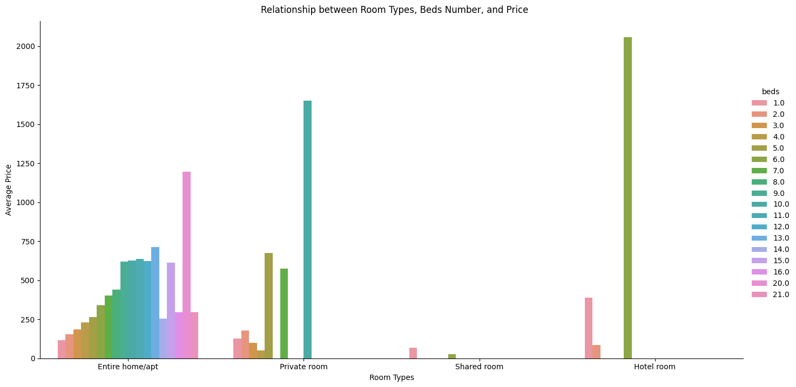

# Jiechen_Li_Mini_9_Colab

## Purpose

* Set up a cloud-hosted Jupyter Notebook (e.g., Google Colab)
* Perform data manipulation tasks on a sample dataset

## Preparation

1. Open Codespaces
2. Create Google Colab Notebook
3. Wait for container to be built with requiremnts.txt installed

## Task Preformed

1. Clone [Jiechen_Li_Mini_2_Pandas](https://github.com/nogibjj/Jiechen_Li_Mini_2_Pandas.git) as the template
2. Creat a new juptyter notebook on Google Colab
3. Perform data manipulation in the Jupyter Notebook
4. Link the Google Colab to GitHub

## Deliverables

* [Link to the cloud-hosted notebook](https://colab.research.google.com/drive/1aAoZy0GuNYF7m7dGOXIIfQOp5lXs9z5R?usp=sharing)
* [Document demonstrating the tasks performed](task_performed.md)

## Visualizations

1. **Relationship between room types and price**
   

2. **Relationship between beds and price**
 

3. **Relationship between room types, beds number, and price**
 
