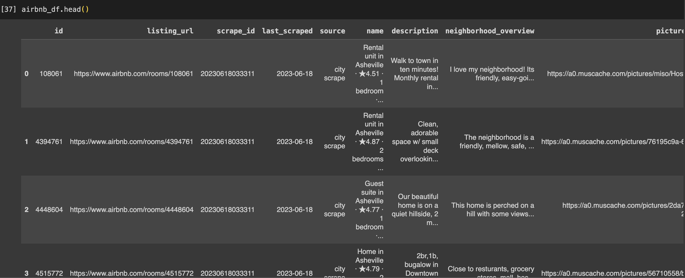
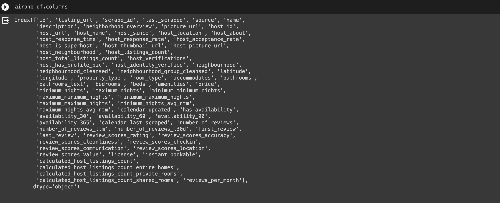
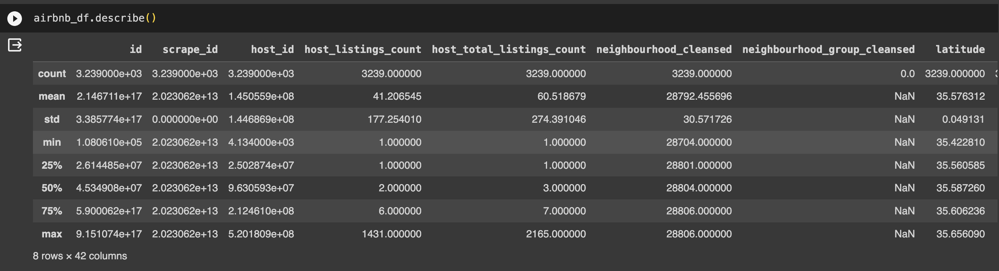
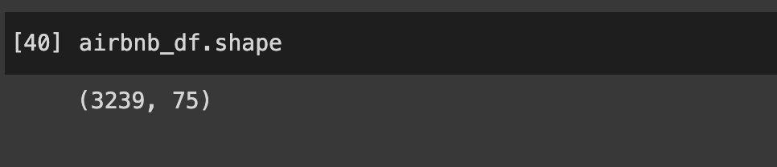
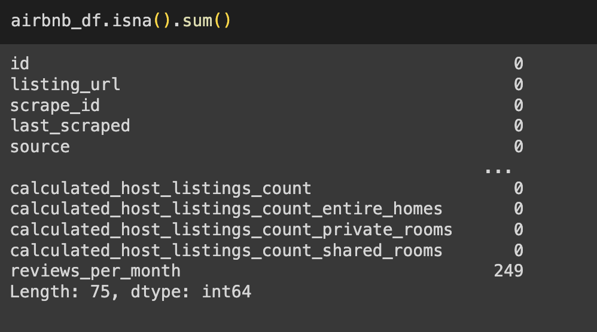
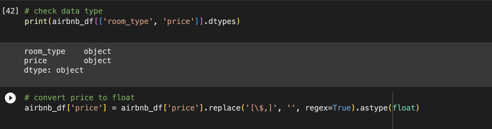
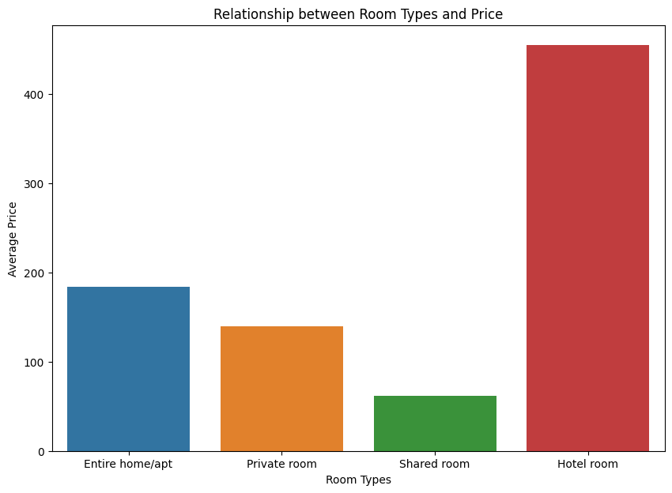
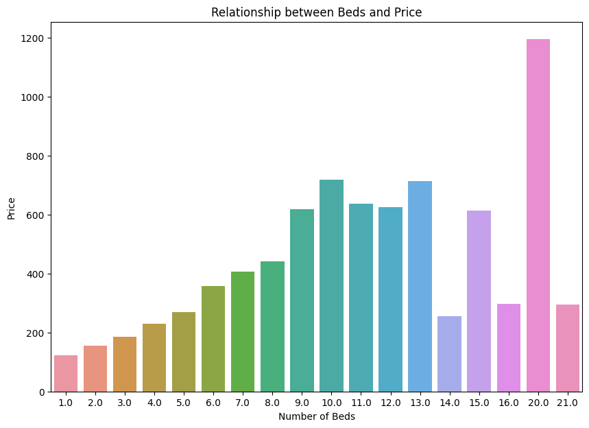
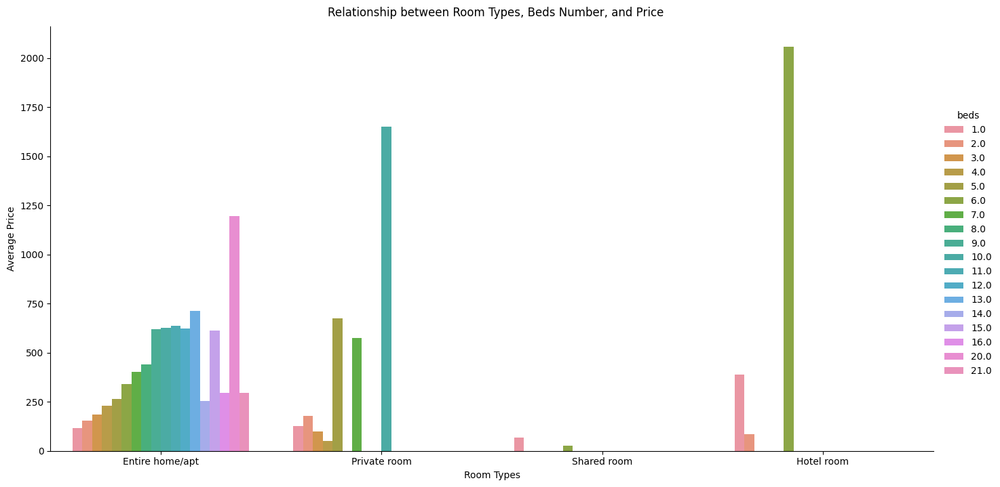

# Airbnb Data Analysis

Airbnb is a platform that allows house and apartment owners to rent their properties to guests for short-term stays. My dataset can be found on [Inside Airbnb](http://insideairbnb.com/get-the-data/). The dataset describes the hosts listing activities and metrics in Asheville, NC.

In my Google Colab Notebook, I use Airbnb dataset to load data, clean data, and do the EDA to examine both room types and beds number affect peice.

## Data Structure: 

1. **The first five rows of the dataset**
 

2. **The columns of the dataset**
 

3. **The general characteristics of the dataset**
 

4. **The sum of rows and columns**
 

5. **The NA values**
 

## Data Cleaning:  

1. **Clean "room_type**
  

## EDA:  

1. **Relationship between room types and price**
   

2. **Relationship between beds and price**
 

3. **Relationship between room types, beds number, and price**
 
